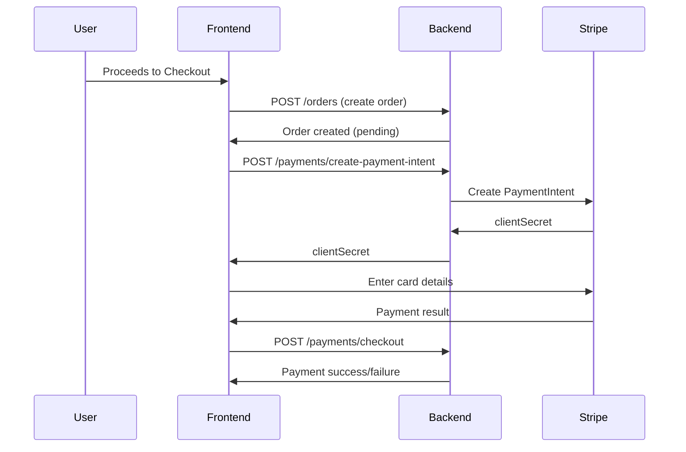

# Payment Pages Implementation Plan

**Project:** ITI Angular E-Commerce Frontend  
**Target:** Payment and Order Management After Checkout  
**Last Updated:** March 2026

---

## Executive Summary

This plan outlines the implementation of payment pages that appear after the checkout process. The implementation will leverage the Payment Module APIs (`/payments`) and Order Module APIs (`/orders`) as documented in `COMPLETE_API_REFERENCE.md`.

---

## 1. Payment Flow Architecture

### 1.1 Flow Diagram



### 1.2 Supported Payment Methods

| Method | Description | API Handling |
|--------|-------------|-------------|
| `stripe` | Credit/debit card via Stripe | Payment Intent + Webhook |
| `paypal` | PayPal checkout | Redirect flow |
| `cod` | Cash on delivery | Payment pending until delivery |
| `wallet` | Deduct from user's wallet balance | Immediate deduction |

---

## 2. DTOs and Type Definitions

### 2.1 Payment Domain DTOs

Create file: `src/app/domains/payment/dto/payment.dto.ts`

```typescript
// Create Payment Intent Request
export interface CreatePaymentIntentRequest {
  orderId: string;
}

export interface CreatePaymentIntentResponse {
  success: boolean;
  data: {
    clientSecret: string;
    paymentIntentId: string;
  };
}

// Checkout Payment Request
export interface CheckoutPaymentRequest {
  orderId: string;
  method: PaymentMethod;
  savedMethodId?: string;
}

export type PaymentMethod = 'stripe' | 'paypal' | 'cod' | 'wallet';

export interface CheckoutPaymentResponse {
  success: boolean;
  message: string;
  data: {
    orderId: string;
    paymentStatus: 'paid' | 'pending' | 'failed';
    transactionId: string;
  };
}

// Payment Status
export interface PaymentStatus {
  status: 'pending' | 'processing' | 'paid' | 'failed' | 'refunded';
  transactionId?: string;
  method: PaymentMethod;
  amount?: number;
}
```

### 2.2 Order Domain DTOs

Create file: `src/app/domains/orders/dto/order.dto.ts`

```typescript
// Create Order Request
export interface CreateOrderRequest {
  shippingAddressIndex: number;
  couponCode?: string;
  paymentMethod: string;
}

// Guest Checkout Request
export interface GuestCheckoutRequest {
  guest_info: {
    name: string;
    email: string;
    phone: string;
  };
  shipping_address: {
    street: string;
    city: string;
    country: string;
    zip: string;
  };
  items: Array<{
    product: string;
    quantity: number;
  }>;
  couponCode?: string;
  paymentMethod: string;
}

// Order Item
export interface OrderItem {
  productId: string;
  name: string;
  price: number;
  quantity: number;
  subtotal: number;
  image?: string;
}

// Shipping Address
export interface ShippingAddress {
  street: string;
  city: string;
  state?: string;
  country: string;
  zip: string;
}

// Order Status Timeline
export interface OrderStatusTimeline {
  status: OrderStatus;
  timestamp: string;
  note?: string;
}

export type OrderStatus = 
  | 'pending' 
  | 'paid' 
  | 'processing' 
  | 'shipped' 
  | 'delivered' 
  | 'cancelled';

// Order Response
export interface Order {
  id: string;
  orderNumber: string;
  status: OrderStatus;
  items: OrderItem[];
  subtotal: number;
  tax: number;
  shipping: number;
  discount?: number;
  total: number;
  shippingAddress: ShippingAddress;
  payment?: {
    method: PaymentMethod;
    status: string;
    transactionId?: string;
  };
  tracking?: {
    number?: string;
    carrier?: string;
  };
  status_timeline: OrderStatusTimeline[];
  createdAt: string;
  updatedAt?: string;
}

export interface OrderListResponse {
  success: boolean;
  data: {
    orders: Order[];
    pagination: {
      page: number;
      limit: number;
      total: number;
      pages: number;
    };
  };
}

export interface OrderDetailResponse {
  success: boolean;
  data: Order;
}

export interface OrderResponse {
  success: boolean;
  message: string;
  data: Order;
}
```

### 2.3 Cart Domain DTOs

Create file: `src/app/domains/cart/dto/cart.dto.ts`

```typescript
// Cart Item
export interface CartItem {
  productId: string;
  name: string;
  price: number;
  quantity: number;
  subtotal: number;
  image?: string;
}

// Cart Response
export interface Cart {
  items: CartItem[];
  subtotal: number;
  tax: number;
  shipping: number;
  total: number;
}

export interface CartResponse {
  success: boolean;
  data: Cart;
}

// Update Cart Item Request
export interface UpdateCartItemRequest {
  productId: string;
  quantity: number;
}

export interface AddToCartRequest {
  productId: string;
  quantity: number;
}
```

---

## 3. Core Services Implementation

### 3.1 PaymentService

Create file: `src/app/core/services/payment.service.ts`

```typescript
import { Injectable, inject } from '@angular/core';
import { Observable } from 'rxjs';
import { ApiService } from './api.service';
import {
  CreatePaymentIntentRequest,
  CreatePaymentIntentResponse,
  CheckoutPaymentRequest,
  CheckoutPaymentResponse,
} from '@domains/payment/dto';

@Injectable({ providedIn: 'root' })
export class PaymentService {
  private readonly api = inject(ApiService);

  createPaymentIntent(orderId: string): Observable<CreatePaymentIntentResponse> {
    return this.api.post<CreatePaymentIntentResponse>('/payments/create-payment-intent', {
      orderId,
    } as CreatePaymentIntentRequest);
  }

  processCheckout(request: CheckoutPaymentRequest): Observable<CheckoutPaymentResponse> {
    return this.api.post<CheckoutPaymentResponse>('/payments/checkout', request);
  }
}
```

### 3.2 OrderService

Create file: `src/app/core/services/order.service.ts`

```typescript
import { Injectable, inject } from '@angular/core';
import { Observable } from 'rxjs';
import { ApiService } from './api.service';
import {
  CreateOrderRequest,
  OrderResponse,
  OrderListResponse,
  OrderDetailResponse,
  GuestCheckoutRequest,
} from '@domains/orders/dto';

@Injectable({ providedIn: 'root' })
export class OrderService {
  private readonly api = inject(ApiService);

  createOrder(request: CreateOrderRequest): Observable<OrderResponse> {
    return this.api.post<OrderResponse>('/orders', request);
  }

  guestCheckout(request: GuestCheckoutRequest): Observable<OrderResponse> {
    return this.api.post<OrderResponse>('/orders/guest', request);
  }

  getMyOrders(params?: { status?: string; page?: number; limit?: number }): Observable<OrderListResponse> {
    return this.api.get<OrderListResponse>('/orders/me', params as any);
  }

  getOrderById(orderId: string): Observable<OrderDetailResponse> {
    return this.api.get<OrderDetailResponse>(`/orders/${orderId}`);
  }
}
```

### 3.3 CartService

Create file: `src/app/core/services/cart.service.ts`

```typescript
import { Injectable, inject, signal } from '@angular/core';
import { Observable, tap } from 'rxjs';
import { ApiService } from './api.service';
import { Cart, CartResponse, AddToCartRequest } from '@domains/cart/dto';

@Injectable({ providedIn: 'root' })
export class CartService {
  private readonly api = inject(ApiService);

  readonly cart = signal<Cart | null>(null);
  readonly isLoading = signal(false);

  getCart(): Observable<CartResponse> {
    this.isLoading.set(true);
    return this.api.get<CartResponse>('/users/cart').pipe(
      tap((response) => {
        this.cart.set(response.data);
        this.isLoading.set(false);
      })
    );
  }

  addToCart(productId: string, quantity: number): Observable<CartResponse> {
    return this.api.put<CartResponse>('/users/cart', { productId, quantity } as AddToCartRequest).pipe(
      tap((response) => {
        this.cart.set(response.data);
      })
    );
  }

  removeFromCart(productId: string): Observable<CartResponse> {
    return this.api.delete<CartResponse>(`/users/cart/${productId}`).pipe(
      tap((response) => {
        this.cart.set(response.data);
      })
    );
  }

  getCartTotal(): number {
    return this.cart()?.total ?? 0;
  }

  getCartItemCount(): number {
    return this.cart()?.items.length ?? 0;
  }
}
```

---

## 4. Components Implementation

### 4.1 CheckoutComponent

**Location:** `src/app/domains/orders/components/checkout/checkout.component.ts`

**Purpose:** Multi-step checkout flow

**Steps:**
1. Shipping Address Selection
2. Payment Method Selection
3. Order Review
4. Payment Processing

**Key Features:**
- Display cart items with quantities and prices
- Show order summary (subtotal, tax, shipping, discount, total)
- Address selection from saved addresses
- Coupon code input
- Payment method selection (stripe/paypal/cod/wallet)
- Loading states during payment processing

### 4.2 PaymentMethodSelectionComponent

**Location:** `src/app/domains/payment/components/payment-method-selection/payment-method-selection.component.ts`

**Purpose:** Select payment method

**UI:**
```html
<div class="payment-methods">
  <div class="form-check">
    <input type="radio" name="paymentMethod" value="stripe" />
    <label>Credit/Debit Card</label>
  </div>
  <div class="form-check">
    <input type="radio" name="paymentMethod" value="paypal" />
    <label>PayPal</label>
  </div>
  <div class="form-check">
    <input type="radio" name="paymentMethod" value="cod" />
    <label>Cash on Delivery</label>
  </div>
  <div class="form-check">
    <input type="radio" name="paymentMethod" value="wallet" />
    <label>Wallet Balance</label>
  </div>
</div>
```

### 4.3 StripePaymentComponent

**Location:** `src/app/domains/payment/components/stripe-payment/stripe-payment.component.ts`

**Purpose:** Handle Stripe card input

**Dependencies:**
- @stripe/stripe-js

**Features:**
- Stripe Elements integration
- Card number, expiry, CVC inputs
- Real-time validation
- Error display
- Processing state

### 4.4 PaymentSuccessComponent

**Location:** `src/app/domains/payment/components/payment-success/payment-success.component.ts`

**Purpose:** Display after successful payment

**UI:**
```html
<div class="text-center">
  <i class="bi bi-check-circle text-success"></i>
  <h2>Payment Successful!</h2>
  <p>Order #{{ orderNumber }}</p>
  <a routerLink="/orders/{{ orderId }}" class="btn btn-primary">View Order</a>
</div>
```

### 4.5 PaymentFailureComponent

**Location:** `src/app/domains/payment/components/payment-failure/payment-failure.component.ts`

**Purpose:** Display after failed payment

**UI:**
```html
<div class="text-center">
  <i class="bi bi-x-circle text-danger"></i>
  <h2>Payment Failed</h2>
  <p>{{ errorMessage }}</p>
  <button (click)="retryPayment()" class="btn btn-primary">Try Again</button>
  <a routerLink="/cart" class="btn btn-outline-secondary">Back to Cart</a>
</div>
```

### 4.6 OrderListComponent

**Location:** `src/app/domains/orders/components/order-list/order-list.component.ts`

**Purpose:** Display user's order history

**Features:**
- List orders with status
- Filter by status (pending, shipped, delivered)
- Pagination
- Order summary (items count, total, date)

### 4.7 OrderDetailComponent

**Location:** `src/app/domains/orders/components/order-detail/order-detail.component.ts`

**Purpose:** Display detailed order information

**Features:**
- Order items list
- Shipping address
- Payment information
- Order timeline/status progression
- Tracking information (if shipped)

### 4.8 OrderTimelineComponent

**Location:** `src/app/domains/orders/components/order-timeline/order-timeline.component.ts`

**Purpose:** Visual order status progression

**Statuses:**
- pending → paid → processing → shipped → delivered

**UI:**
```html
<ul class="timeline">
  <li [class.active]="currentStatus === 'pending'">Pending</li>
  <li [class.active]="currentStatus === 'paid'">Paid</li>
  <li [class.active]="currentStatus === 'processing'">Processing</li>
  <li [class.active]="currentStatus === 'shipped'">Shipped</li>
  <li [class.active]="currentStatus === 'delivered'">Delivered</li>
</ul>
```

### 4.9 CartComponent

**Location:** `src/app/domains/cart/components/cart/cart.component.ts`

**Purpose:** Display and manage shopping cart

**Features:**
- List cart items with quantities
- Update quantity (with debounce)
- Remove items
- Show subtotal, tax, shipping, total
- Proceed to checkout button

---

## 5. Domain Routes

### 5.1 Payment Routes

Create file: `src/app/domains/payment/routes.ts`

```typescript
import { Routes } from '@angular/router';

export const paymentRoutes: Routes = [
  {
    path: 'success/:orderId',
    loadComponent: () =>
      import('./components/payment-success/payment-success.component').then(
        (m) => m.PaymentSuccessComponent
      ),
  },
  {
    path: 'failure/:orderId',
    loadComponent: () =>
      import('./components/payment-failure/payment-failure.component').then(
        (m) => m.PaymentFailureComponent
      ),
  },
];
```

### 5.2 Order Routes

Create file: `src/app/domains/orders/routes.ts`

```typescript
import { Routes } from '@angular/router';

export const orderRoutes: Routes = [
  {
    path: '',
    loadComponent: () =>
      import('./components/order-list/order-list.component').then(
        (m) => m.OrderListComponent
      ),
  },
  {
    path: ':id',
    loadComponent: () =>
      import('./components/order-detail/order-detail.component').then(
        (m) => m.OrderDetailComponent
      ),
  },
];
```

### 5.3 Cart Routes

Create file: `src/app/domains/cart/routes.ts`

```typescript
import { Routes } from '@angular/router';

export const cartRoutes: Routes = [
  {
    path: '',
    loadComponent: () =>
      import('./components/cart/cart.component').then(
        (m) => m.CartComponent
      ),
  },
];
```

---

## 6. App Routes Update

Update `src/app/app.routes.ts`:

```typescript
import { Routes } from '@angular/router';
import { authGuard } from './core/guards/auth.guard';
import { MainLayoutComponent } from './layouts/main-layout/main-layout.component';
import { AuthLayoutComponent } from './layouts/auth-layout/auth-layout.component';
import { HomeComponent } from './domains/home/home.component';

export const routes: Routes = [
  {
    path: 'auth',
    component: AuthLayoutComponent,
    loadChildren: () => import('./domains/auth/routes').then((m) => m.authRoutes),
  },
  {
    path: '',
    component: MainLayoutComponent,
    canActivate: [authGuard],
    children: [
      { path: '', redirectTo: 'home', pathMatch: 'full' },
      { path: 'home', component: HomeComponent },
      
      // Products
      {
        path: 'products',
        loadChildren: () => import('./domains/products/routes').then((m) => m.productRoutes),
      },
      
      // Cart
      {
        path: 'cart',
        loadChildren: () => import('./domains/cart/routes').then((m) => m.cartRoutes),
      },
      
      // Checkout
      {
        path: 'checkout',
        loadComponent: () => 
          import('./domains/orders/components/checkout/checkout.component').then(
            (m) => m.CheckoutComponent
          ),
      },
      
      // Orders
      {
        path: 'orders',
        loadChildren: () => import('./domains/orders/routes').then((m) => m.orderRoutes),
      },
      
      // Payment
      {
        path: 'payment',
        loadChildren: () => import('./domains/payment/routes').then((m) => m.paymentRoutes),
      },
    ],
  },
  { path: '**', redirectTo: 'home' },
];
```

---

## 7. Payment Facade Service

Create file: `src/app/domains/payment/services/payment-facade.service.ts`

```typescript
import { Injectable, inject, signal } from '@angular/core';
import { Router } from '@angular/router';
import { Observable, of, catchError, tap } from 'rxjs';
import { PaymentService } from '@core/services/payment.service';
import { OrderService } from '@core/services/order.service';
import { CartService } from '@core/services/cart.service';
import {
  CheckoutPaymentRequest,
  PaymentMethod,
} from '../dto/payment.dto';
import { CreateOrderRequest } from '../dto/order.dto';

@Injectable({ providedIn: 'root' })
export class PaymentFacadeService {
  private readonly paymentService = inject(PaymentService);
  private readonly orderService = inject(OrderService);
  private readonly cartService = inject(CartService);
  private readonly router = inject(Router);

  readonly isProcessing = signal(false);
  readonly currentOrderId = signal<string | null>(null);
  readonly error = signal<string | null>(null);
  readonly clientSecret = signal<string | null>(null);

  createOrder(checkoutData: CreateOrderRequest): Observable<any> {
    this.isProcessing.set(true);
    this.error.set(null);

    return this.orderService.createOrder(checkoutData).pipe(
      tap((response) => {
        this.currentOrderId.set(response.data.id);
        this.isProcessing.set(false);
      }),
      catchError((err) => {
        this.error.set(err.error?.message || 'Failed to create order');
        this.isProcessing.set(false);
        return of(null);
      })
    );
  }

  createPaymentIntent(orderId: string): Observable<any> {
    return this.paymentService.createPaymentIntent(orderId).pipe(
      tap((response) => {
        this.clientSecret.set(response.data.clientSecret);
      })
    );
  }

  processPayment(request: CheckoutPaymentRequest): Observable<any> {
    this.isProcessing.set(true);
    this.error.set(null);

    return this.paymentService.processCheckout(request).pipe(
      tap((response) => {
        if (response.data.paymentStatus === 'paid') {
          this.cartService.getCart(); // Refresh cart
          this.router.navigate(['/payment/success', request.orderId]);
        }
        this.isProcessing.set(false);
      }),
      catchError((err) => {
        this.error.set(err.error?.message || 'Payment failed');
        this.isProcessing.set(false);
        this.router.navigate(['/payment/failure', request.orderId]);
        return of(null);
      })
    );
  }

  clearState(): void {
    this.isProcessing.set(false);
    this.currentOrderId.set(null);
    this.error.set(null);
    this.clientSecret.set(null);
  }
}
```

---

## 8. Error Handling

### 8.1 Payment Errors

| Error Code | Message | User Action |
|------------|---------|-------------|
| `PAYMENT.INSUFFICIENT_BALANCE` | Wallet balance insufficient | Show wallet top-up option |
| `PAYMENT.STRIPE_ERROR` | Card declined | Suggest different card |
| `PAYMENT.COD_UNAVAILABLE` | COD not available for this order | Select different payment |
| `PAYMENT.NETWORK_ERROR` | Network error | Retry button |

### 8.2 Order Errors

| Error Code | Message | User Action |
|------------|---------|-------------|
| `ORDER.OUT_OF_STOCK` | Item out of stock | Remove item, show alternatives |
| `ORDER.INVALID_ADDRESS` | Invalid shipping address | Edit address |
| `ORDER.COUPON_INVALID` | Invalid coupon | Show coupon error |

---

## 9. File Structure Summary

```
src/app/
├── core/
│   └── services/
│       ├── payment.service.ts     # NEW
│       ├── order.service.ts       # NEW
│       └── cart.service.ts       # NEW
│
├── domains/
│   ├── payment/
│   │   ├── dto/
│   │   │   └── payment.dto.ts     # NEW
│   │   ├── routes.ts              # NEW
│   │   ├── components/
│   │   │   ├── payment-success/   # NEW
│   │   │   └── payment-failure/   # NEW
│   │   └── services/
│   │       └── payment-facade.service.ts  # NEW
│   │
│   ├── orders/
│   │   ├── dto/
│   │   │   └── order.dto.ts       # NEW
│   │   ├── routes.ts              # NEW
│   │   └── components/
│   │       ├── checkout/          # NEW
│   │       ├── order-list/       # NEW
│   │       ├── order-detail/     # NEW
│   │       └── order-timeline/   # NEW
│   │
│   └── cart/
│       ├── dto/
│       │   └── cart.dto.ts       # NEW
│       ├── routes.ts              # NEW
│       └── components/
│           └── cart/              # NEW
│
└── app.routes.ts                 # UPDATED
```

---

## 10. Implementation Checklist

- [ ] Create Payment DTOs
- [ ] Create Order DTOs
- [ ] Create Cart DTOs
- [ ] Implement PaymentService
- [ ] Implement OrderService
- [ ] Implement CartService
- [ ] Create Payment routes
- [ ] Create CheckoutComponent
- [ ] Create PaymentMethodSelectionComponent
- [ ] Create StripePaymentComponent
- [ ] Create PaymentSuccessComponent
- [ ] Create PaymentFailureComponent
- [ ] Create OrderListComponent
- [ ] Create OrderDetailComponent
- [ ] Create OrderTimelineComponent
- [ ] Create CartComponent
- [ ] Update app.routes.ts
- [ ] Create PaymentFacadeService
- [ ] Test payment flow

---

## 11. Dependencies

Add to `package.json`:

```json
{
  "@stripe/stripe-js": "^2.4.0"
}
```

---

## 12. API Endpoints Used

| Endpoint | Method | Purpose |
|----------|--------|---------|
| `/orders` | POST | Create order from cart |
| `/orders/guest` | POST | Guest checkout |
| `/orders/me` | GET | Get user's orders |
| `/orders/:id` | GET | Get order details |
| `/payments/create-payment-intent` | POST | Create Stripe payment intent |
| `/payments/checkout` | POST | Process payment |
| `/users/cart` | GET | Get cart |
| `/users/cart` | PUT | Add/update cart item |
| `/users/cart/:productId` | DELETE | Remove from cart |
| `/coupons/validate` | POST | Validate coupon |

---

This plan provides a complete roadmap for implementing the payment pages. Each component follows the established patterns in the codebase: standalone components, signals for state, facade pattern for business logic, and Bootstrap for styling.
